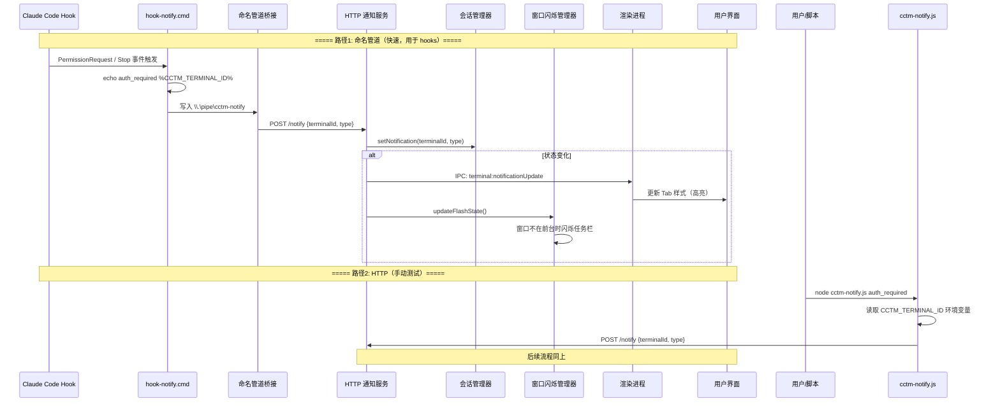

# CCTM 通知系统 - 完整流程

## 系统架构概览

```
┌──────────────────────────────────────────────────────────────────────────────────┐
│                                 CCTM 应用                                        │
│  ┌────────────────┐  ┌──────────────┐  ┌────────────┐  ┌─────────────────┐    │
│  │ 命名管道桥接服务 │  │ HTTP 通知服务 │  │  会话管理器 │  │  窗口闪烁管理器  │    │
│  │ (\\.\pipe\..)   │──▶│ (Port 13452) │  │ (Session)  │  │ (Taskbar Flash) │    │
│  └────────────────┘  └──────────────┘  └────────────┘  └─────────────────┘    │
│         ↑                   │                    │                    │         │
│         │                   │                    │ IPC                │         │
│  ┌──────┴───────┐    ┌─────┴──────┐       ┌─────┴──────┐     ┌──────┴──────┐  │
│  │ hook-notify  │    │ cctm-notify│       │  渲染进程   │     │ 任务栏图标   │  │
│  │  .cmd (快速) │    │  .js (HTTP)│       │ (React UI) │     │   闪烁      │  │
│  └──────────────┘    └────────────┘       └────────────┘     └─────────────┘  │
└──────────────────────────────────────────────────────────────────────────────────┘
```

## 两条通知路径

| 路径 | 触发方式 | 延迟 | 工具 |
|------|---------|------|------|
| **命名管道**（推荐） | Claude Code hooks | ~0ms | `hook-notify.cmd` |
| **HTTP** | 手动测试/脚本 | ~2-3s | `cctm-notify.js` |

## 详细流程



## 数据流转详解

### 阶段 1: 终端启动（环境变量注入）

```
CCTM 创建终端 → pty-service.ts
                      ↓
    const terminalEnv = {
      ...process.env,
      CCTM_TERMINAL_ID: "<uuid>"    ← 唯一标识
    }
    pty.spawn(shellPath, [], { env: terminalEnv })
                      ↓
    终端进程继承环境变量 → 子进程（如 Claude Code）自动获得
```

### 阶段 2: Hook 触发

**路径 A — 命名管道（快速）**

```
Claude Code 触发 hook 事件（PermissionRequest / Stop）
        ↓
执行: cmd //c "hook-notify.cmd" auth_required
        ↓
hook-notify.cmd:
  echo %1 %CCTM_TERMINAL_ID% > \\.\pipe\cctm-notify
        ↓
named-pipe-bridge.ts 接收消息，解析 type + terminalId
        ↓
转发到 HTTP 通知服务: POST http://127.0.0.1:13452/notify
```

**路径 B — HTTP（测试）**

```
用户/脚本执行: node cctm-notify.js auth_required
        ↓
cctm-notify.js:
  1. 优先使用命令行参数 terminalId
  2. 否则读取 process.env.CCTM_TERMINAL_ID
  3. 都没有则静默退出
        ↓
POST http://127.0.0.1:13452/notify
  { terminalId, type, timestamp }
```

### 阶段 3: 通知处理（HTTP 服务 + 会话管理器）

```
HTTP 通知服务 (http-notification-service.ts)
        ↓
  1. 验证通知类型: auth_required / session_ended / error
  2. 验证 terminalId 格式（必须是 UUID v4）
  3. sessionManager.setNotification(terminalId, type)
        ↓
  if (状态变化) {
    mainWindow.send('terminal:notificationUpdate', notifications)
    windowFlashManager.updateFlashState()
  }
```

### 阶段 4: 渲染进程（IPC → UI 更新）

```
主进程 → IPC: terminal:notificationUpdate
              [{ id: "abc-123", type: "auth_required" }]
        ↓
preload/index.ts → window.electronAPI.onNotificationUpdate()
        ↓
App.tsx → setNotifications(new Map(...))
        ↓
UI 更新:
  - notification-auth    → ⚠ 图标 + 红色高亮
  - notification-ended   → ◉ 图标 + 黄色高亮
  - notification-error   → ✕ 图标 + 红色高亮
```

### 阶段 5: 任务栏闪烁（窗口不在前台时）

```
windowFlashManager.updateFlashState()
        ↓
  shouldFlash() = 有新通知 && (窗口未聚焦 || 窗口最小化)
        ↓
  true → mainWindow.flashFrame(true)  → 任务栏图标闪烁
  false → mainWindow.flashFrame(false) → 停止闪烁
        ↓
  窗口获得焦点时自动停止闪烁
```

## 优先级决策树（cctm-notify.js）

```
                cctm-notify.js 执行
                        │
                        ▼
                ┌───────────────┐
                │ 有命令行参数? │
                └───────┬───────┘
                  是 │         │ 否
                     ▼         ▼
                使用参数ID ┌───────────────┐
                          │ 有环境变量?   │
                          └───────┬───────┘
                            是 │         │ 否
                               ▼         ▼
                        使用环境变量ID   静默退出
                        (当前终端)
```

## 错误处理

| 场景 | 表现 |
|------|------|
| CCTM 未运行 | HTTP: ECONNREFUSED；管道: 写入失败（静默） |
| 无 terminalId | cctm-notify.js 静默退出；管道消息无 ID 被 HTTP 服务忽略 |
| 通知类型无效 | HTTP 返回 400；管道消息被桥接服务拒绝 |
| terminalId 非 UUID | HTTP 服务忽略该通知 |

## 文件依赖关系

```
通知系统核心文件:

hook-notify.cmd
  └── 写入命名管道 \\.\pipe\cctm-notify

named-pipe-bridge.ts (命名管道桥接)
  └── 转发到 HTTP 通知服务

http-notification-service.ts
  ├── session-manager.ts (获取/设置通知状态)
  ├── window-flash-manager.ts (任务栏闪烁)
  └── BrowserWindow (IPC 通信到渲染进程)

pty-service.ts
  ├── 注入 CCTM_TERMINAL_ID 环境变量
  └── 监听终端退出事件 → 自动触发 session_ended 通知

session-manager.ts
  └── 管理通知状态和时间戳（用于判断"新通知"）

cctm-notify.js
  └── process.env.CCTM_TERMINAL_ID (读取环境变量)

App.tsx (渲染进程)
  ├── electronAPI.onNotificationUpdate (监听 IPC)
  └── notification CSS classes (Tab 高亮样式)
```

## Claude Code Hooks 配置

```json
{
  "hooks": {
    "PermissionRequest": [
      {
        "matcher": "*",
        "hooks": [{
          "type": "command",
          "command": "cmd //c \"D:\\myProject\\cctm\\tools\\hook-notify.cmd\" auth_required"
        }]
      }
    ],
    "Stop": [
      {
        "hooks": [{
          "type": "command",
          "command": "cmd //c \"D:\\myProject\\cctm\\tools\\hook-notify.cmd\" session_ended"
        }]
      }
    ]
  }
}
```

注意事项：
- 使用 `cmd //c`（bash 环境下避免路径冲突）
- 路径使用反斜杠（Windows 原生格式）
- `PermissionRequest` 在权限对话框出现时触发
- `Stop` 在 Claude 完成响应时触发
